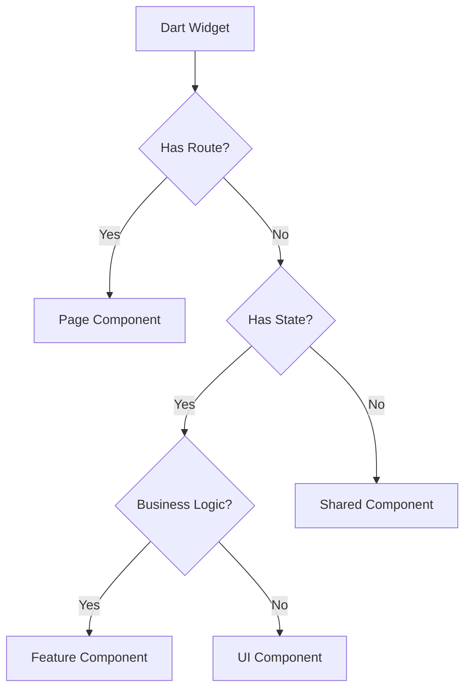
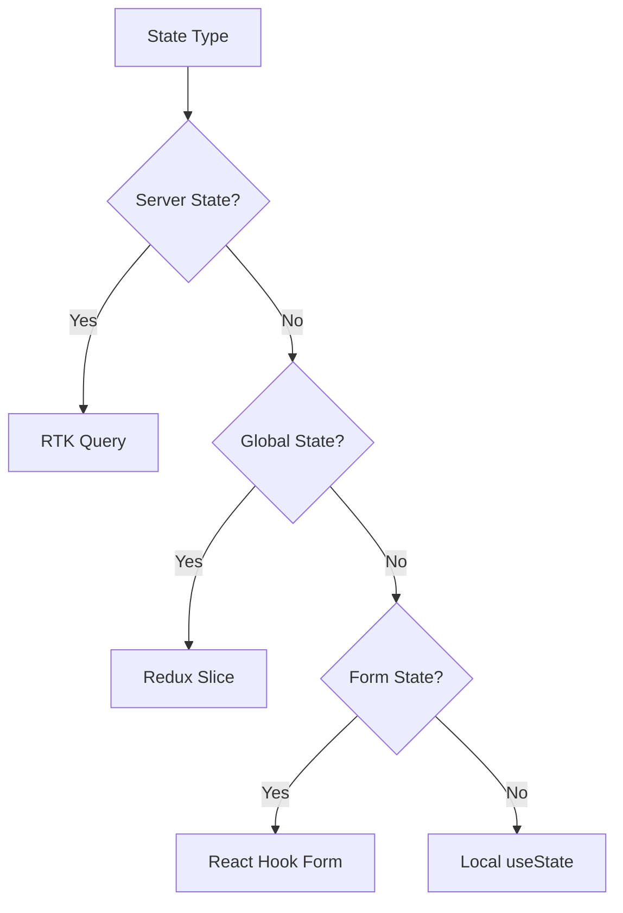

# Phase 2: TypeScript/React Architecture Planning

## Overview

Phase 2 transforms the functional understanding from Phase 1 into a concrete React 18 + TypeScript architecture. This phase establishes the project structure, component hierarchy, Redux Toolkit store design, and dependency mappings before any code generation begins.

## Key Objectives

1. **Design React Architecture**: Create component hierarchy and project structure
2. **Plan Redux Store**: Design RTK slices and RTK Query APIs
3. **Map Dependencies**: Convert Dart packages to npm equivalents
4. **Generate Configurations**: Create Vite, TypeScript, and testing configs

## Architecture Planning Process

### Step 1: Analyze Functional Model

```typescript
interface FunctionalAnalysis {
  coreFeatures: Feature[];
  userWorkflows: Workflow[];
  dataModels: DataModel[];
  stateManagement: StateManagement;
  apiEndpoints: APIEndpoint[];
  businessRules: BusinessRule[];
}
```

### Step 2: Design Component Hierarchy

#### Component Categories

1. **Pages** (Route-level components)
   - Mapped from Dart screens/pages
   - Connected to React Router v6
   - Lazy-loaded with React.lazy()

2. **Layouts** (Wrapper components)
   - App shells and navigation
   - Theme providers
   - Authentication wrappers

3. **Features** (Business logic components)
   - Complex components with state
   - Connected to Redux store
   - May use RTK Query hooks

4. **Shared** (Reusable UI components)
   - Pure presentational components
   - No direct Redux connections
   - Highly reusable across features

#### Example Component Mapping

```typescript
// Dart Widget → React Component
class UserListWidget extends StatefulWidget → const UserList: React.FC
class UserCard extends StatelessWidget → const UserCard: React.FC
StreamBuilder → useQuery (RTK Query) or useEffect + useState
FutureBuilder → Suspense + useQuery
```

### Step 3: Redux Toolkit Store Design

#### Store Structure

```typescript
interface StoreStructure {
  // Feature slices (using createSlice)
  auth: AuthState;
  users: UsersState;
  products: ProductsState;

  // RTK Query API slices
  api: ApiState;

  // UI state
  ui: UIState;
}
```

#### Slice Design Patterns

```typescript
// Modern RTK slice with Immer
const usersSlice = createSlice({
  name: 'users',
  initialState: {
    entities: {},
    ids: [],
    loading: 'idle',
    currentUserId: null,
  },
  reducers: {
    userAdded: (state, action) => {
      // Immer allows "mutating" syntax
      state.entities[action.payload.id] = action.payload;
      state.ids.push(action.payload.id);
    },
  },
  extraReducers: (builder) => {
    // Handle RTK Query or async thunk actions
  },
});
```

#### RTK Query API Design

```typescript
const api = createApi({
  reducerPath: 'api',
  baseQuery: fetchBaseQuery({
    baseUrl: '/api',
    prepareHeaders: (headers, { getState }) => {
      const token = (getState() as RootState).auth.token;
      if (token) {
        headers.set('authorization', `Bearer ${token}`);
      }
      return headers;
    },
  }),
  tagTypes: ['User', 'Product', 'Order'],
  endpoints: (builder) => ({
    getUsers: builder.query<User[], void>({
      query: () => 'users',
      providesTags: ['User'],
    }),
    updateUser: builder.mutation<User, Partial<User>>({
      query: ({ id, ...patch }) => ({
        url: `users/${id}`,
        method: 'PATCH',
        body: patch,
      }),
      invalidatesTags: ['User'],
    }),
  }),
});
```

### Step 4: Project Structure

```
src/
├── app/
│   ├── store.ts           # Redux store configuration
│   ├── hooks.ts           # Typed Redux hooks
│   └── api.ts             # RTK Query API slice
├── features/
│   ├── auth/
│   │   ├── authSlice.ts
│   │   ├── AuthForm.tsx
│   │   └── authApi.ts
│   ├── users/
│   │   ├── usersSlice.ts
│   │   ├── UserList.tsx
│   │   ├── UserDetail.tsx
│   │   └── usersApi.ts
│   └── products/
├── components/            # Shared UI components
│   ├── Button/
│   ├── Card/
│   └── Layout/
├── pages/                # Route-level components
│   ├── HomePage.tsx
│   ├── DashboardPage.tsx
│   └── SettingsPage.tsx
├── services/             # External service integrations
├── utils/               # Utility functions
├── types/              # TypeScript type definitions
└── styles/            # Global styles
```

### Step 5: Dependency Resolution

#### Package Mapping Strategy

1. **Direct Equivalents**: Map Dart packages to exact npm equivalents
2. **Functional Replacements**: Find packages with similar functionality
3. **Custom Implementations**: Flag for manual implementation
4. **Elimination**: Remove packages not needed in web context

#### Common Mappings

| Dart Package         | NPM Package                        | Notes                |
| -------------------- | ---------------------------------- | -------------------- |
| `provider`           | `react-redux` + `@reduxjs/toolkit` | State management     |
| `dio`                | `axios` + `axios-retry`            | HTTP client          |
| `go_router`          | `react-router-dom`                 | Routing              |
| `rxdart`             | `rxjs`                             | Reactive programming |
| `shared_preferences` | `localforage`                      | Local storage        |
| `json_serializable`  | TypeScript interfaces              | Built-in             |

### Step 6: Configuration Generation

#### Vite Configuration

```typescript
// vite.config.ts
import { defineConfig } from 'vite';
import react from '@vitejs/plugin-react';
import path from 'path';

export default defineConfig({
  plugins: [react()],
  resolve: {
    alias: {
      '@': path.resolve(__dirname, './src'),
      '@features': path.resolve(__dirname, './src/features'),
      '@components': path.resolve(__dirname, './src/components'),
      '@store': path.resolve(__dirname, './src/store'),
    },
  },
  optimizeDeps: {
    include: ['react', 'react-dom', '@reduxjs/toolkit', 'react-redux'],
  },
  build: {
    target: 'esnext',
    minify: 'esbuild',
    sourcemap: true,
    rollupOptions: {
      output: {
        manualChunks: {
          vendor: ['react', 'react-dom'],
          redux: ['@reduxjs/toolkit', 'react-redux'],
        },
      },
    },
  },
});
```

#### TypeScript Configuration

```json
{
  "compilerOptions": {
    "target": "ES2022",
    "lib": ["ES2022", "DOM", "DOM.Iterable"],
    "module": "ESNext",
    "jsx": "react-jsx",
    "strict": true,
    "moduleResolution": "bundler",
    "allowImportingTsExtensions": true,
    "resolveJsonModule": true,
    "isolatedModules": true,
    "noEmit": true,
    "skipLibCheck": true,
    "baseUrl": ".",
    "paths": {
      "@/*": ["src/*"],
      "@features/*": ["src/features/*"],
      "@components/*": ["src/components/*"],
      "@store/*": ["src/app/*"]
    }
  },
  "include": ["src"],
  "references": [{ "path": "./tsconfig.node.json" }]
}
```

## Implementation Classes

### ReactArchitect

```typescript
export class ReactArchitect {
  constructor(private analysis: FunctionalAnalysis) {}

  async planArchitecture(): Promise<ReactArchitecture> {
    return {
      framework: 'react',
      version: '18',
      buildTool: 'vite',
      stateManagement: 'redux-toolkit',
      projectStructure: await this.designProjectStructure(),
      componentHierarchy: await this.planComponentHierarchy(),
      reduxStructure: await this.designReduxStructure(),
      routingStrategy: await this.determineRoutingStrategy(),
      dependencies: await this.mapDependencies(),
      dataFetching: 'rtk-query', // Prioritize RTK Query
    };
  }

  private async planComponentHierarchy(): Promise<ComponentHierarchy> {
    const components = this.analysis.coreFeatures.flatMap((feature) =>
      this.extractComponentsFromFeature(feature)
    );

    return {
      pages: components.filter((c) => c.type === 'page'),
      layouts: components.filter((c) => c.type === 'layout'),
      features: components.filter((c) => c.type === 'feature'),
      shared: components.filter((c) => c.type === 'shared'),
    };
  }

  private async designReduxStructure(): Promise<ReduxStructure> {
    const slices = this.analysis.dataModels.map((model) => ({
      name: model.name.toLowerCase(),
      state: this.mapModelToState(model),
      actions: this.extractActionsForModel(model),
      selectors: this.generateSelectors(model),
    }));

    const apiEndpoints = this.analysis.apiEndpoints.map((endpoint) => ({
      name: endpoint.name,
      method: endpoint.method,
      url: endpoint.path,
      queryFn: this.generateQueryFn(endpoint),
    }));

    return {
      slices,
      apiEndpoints,
      middleware: ['api.middleware'],
      enhancers: [],
    };
  }
}
```

### DependencyMapper

```typescript
export class DependencyMapper {
  private readonly mappings = new Map<string, string[]>();

  constructor() {
    this.initializeMappings();
  }

  async mapDependencies(dartDeps: string[]): Promise<PackageJson> {
    const dependencies: Record<string, string> = {
      // Core React 18
      'react': '^18.2.0',
      'react-dom': '^18.2.0',

      // Redux Toolkit
      '@reduxjs/toolkit': '^2.0.0',
      'react-redux': '^9.0.0',

      // Routing
      'react-router-dom': '^6.20.0',
    };

    const devDependencies: Record<string, string> = {
      // TypeScript
      'typescript': '^5.3.0',
      '@types/react': '^18.2.0',
      '@types/react-dom': '^18.2.0',

      // Vite
      'vite': '^5.0.0',
      '@vitejs/plugin-react': '^4.2.0',

      // Testing
      'vitest': '^1.0.0',
      '@testing-library/react': '^14.0.0',

      // Linting
      'eslint': '^8.50.0',
      '@typescript-eslint/eslint-plugin': '^6.0.0',
      '@typescript-eslint/parser': '^6.0.0',
    };

    // Map Dart dependencies to npm packages
    for (const dartDep of dartDeps) {
      const npmPackages = this.mappings.get(dartDep);
      if (npmPackages) {
        npmPackages.forEach((pkg) => {
          const [name, version] = pkg.split('@').filter(Boolean);
          dependencies[name] = version || 'latest';
        });
      }
    }

    return {
      name: 'converted-app',
      version: '1.0.0',
      type: 'module',
      scripts: {
        'dev': 'vite',
        'build': 'tsc && vite build',
        'preview': 'vite preview',
        'test': 'vitest',
        'lint': 'eslint . --ext ts,tsx',
        'type-check': 'tsc --noEmit',
      },
      dependencies,
      devDependencies,
    };
  }
}
```

## Decision Trees

### Component Type Decision



### State Management Decision



## Error Handling Strategies

### Type Conversion Errors

1. **Missing Type Mappings**: Default to `any` with TODO comment
2. **Complex Generic Types**: Simplify to base types initially
3. **Null Safety**: Add explicit null checks and optional chaining

### Dependency Resolution Errors

1. **No Direct Equivalent**: Log for manual review
2. **Version Conflicts**: Use latest stable versions
3. **Platform-Specific Packages**: Skip or find web alternatives

## Quality Assurance Checklist

- [ ] All Dart screens mapped to React pages
- [ ] State management strategy defined for each data model
- [ ] API endpoints converted to RTK Query endpoints
- [ ] Dependencies mapped with fallback strategies
- [ ] TypeScript strict mode enabled
- [ ] Path aliases configured
- [ ] Lazy loading implemented for routes
- [ ] Error boundaries planned for critical components
- [ ] Accessibility requirements identified

## Next Steps

After completing Phase 2 architecture planning:

1. Review generated architecture with stakeholders
2. Validate dependency mappings
3. Proceed to Phase 3: Code Generation
4. Set up parallel generation with Ollama for simple components
5. Use Claude for complex business logic implementation
