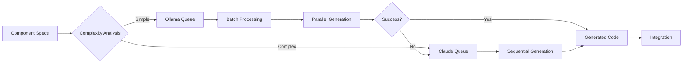

# Phase 3: Code Generation

## Overview

Phase 3 transforms the architecture plan into actual React 18 + TypeScript code using an intelligent LLM orchestration strategy. Claude handles complex business logic and architectural decisions, while Ollama/Qwen 2.5 Coder generates simple components in parallel for maximum efficiency.

## Generation Strategy

### LLM Task Distribution

| Task Type          | LLM    | Reasoning                    |
| ------------------ | ------ | ---------------------------- |
| Redux Store Setup  | Claude | Complex state architecture   |
| RTK Query APIs     | Claude | Business logic understanding |
| Complex Components | Claude | Stateful logic, side effects |
| Simple Components  | Ollama | Parallel generation          |
| Utility Functions  | Ollama | Pure functions, parallel     |
| Test Generation    | Ollama | Pattern-based, parallel      |
| Type Definitions   | Claude | Accuracy critical            |

### Parallel Generation Architecture

```typescript
interface GenerationTask {
  id: string;
  type: 'component' | 'utility' | 'test' | 'types';
  complexity: 'simple' | 'complex';
  dependencies: string[];
  llm: 'claude' | 'ollama';
  priority: number;
}

class LLMOrchestrator {
  private claudeQueue: GenerationTask[] = [];
  private ollamaQueue: GenerationTask[] = [];
  private completedTasks = new Map<string, GeneratedCode>();

  async orchestrateGeneration(
    architecture: ReactArchitecture,
  ): Promise<GeneratedProject> {
    // Phase 1: Critical path with Claude
    const criticalTasks = await this.generateCriticalPath(architecture);

    // Phase 2: Parallel generation with Ollama
    const parallelTasks = await this.generateInParallel(architecture);

    // Phase 3: Integration and refinement
    return this.integrateAndRefine(criticalTasks, parallelTasks);
  }
}
```

## Component Generation

### Complex Component Template (Claude)

```typescript
interface ComponentSpec {
  name: string;
  type: 'page' | 'feature' | 'layout';
  props: PropDefinition[];
  state: StateDefinition[];
  hooks: string[];
  reduxConnections: ReduxConnection[];
  apiCalls: APICall[];
}

// Generation prompt for Claude
const complexComponentPrompt = `
Generate a React 18 component with TypeScript.

Component: ${spec.name}
Type: ${spec.type}
Features:
- Uses Redux Toolkit with useSelector and useDispatch
- Implements error boundaries where appropriate
- Uses React.memo for optimization
- Includes proper TypeScript types
- Follows React 18 best practices (Suspense, concurrent features)

Props: ${JSON.stringify(spec.props)}
State Management: ${JSON.stringify(spec.reduxConnections)}
API Calls: Uses RTK Query hooks

Requirements:
1. Use functional components with hooks
2. Implement proper loading and error states
3. Use Suspense for data fetching where appropriate
4. Include accessibility attributes
5. Follow mobile-first responsive design

Generate the complete component implementation.
`;
```

### Simple Component Template (Ollama)

```typescript
// Generation prompt for Ollama
const simpleComponentPrompt = `
Create a React functional component with TypeScript.

Component: ${name}
Props: ${JSON.stringify(props)}
Type: Presentational component (no state)

Template:
import React from 'react';

interface ${name}Props {
  // Define props
}

export const ${name}: React.FC<${name}Props> = ({ ...props }) => {
  return (
    <div>
      {/* Component JSX */}
    </div>
  );
};

Requirements:
- Pure functional component
- No side effects
- TypeScript interfaces
- Semantic HTML
- CSS modules or Tailwind classes
`;
```

## Redux Toolkit Generation

### Store Configuration

```typescript
// Generated store.ts
import { configureStore } from '@reduxjs/toolkit';
import { setupListeners } from '@reduxjs/toolkit/query';
import { api } from './api';
import authSlice from '../features/auth/authSlice';
import usersSlice from '../features/users/usersSlice';

export const store = configureStore({
  reducer: {
    [api.reducerPath]: api.reducer,
    auth: authSlice,
    users: usersSlice,
  },
  middleware: (getDefaultMiddleware) =>
    getDefaultMiddleware({
      serializableCheck: {
        ignoredActions: [FLUSH, REHYDRATE, PAUSE, PERSIST, PURGE, REGISTER],
      },
    }).concat(api.middleware),
});

setupListeners(store.dispatch);

export type RootState = ReturnType<typeof store.getState>;
export type AppDispatch = typeof store.dispatch;
```

### RTK Query API Generation

```typescript
// Template for API generation
const apiGenerationTemplate = `
import { createApi, fetchBaseQuery } from '@reduxjs/toolkit/query/react';
import type { ${types.join(', ')} } from './types';

export const api = createApi({
  reducerPath: 'api',
  baseQuery: fetchBaseQuery({
    baseUrl: process.env.REACT_APP_API_URL || '/api',
    prepareHeaders: (headers, { getState }) => {
      const token = (getState() as RootState).auth.token;
      if (token) {
        headers.set('authorization', \`Bearer \${token}\`);
      }
      return headers;
    },
  }),
  tagTypes: [${tagTypes.map((t) => `'${t}'`).join(', ')}],
  endpoints: (builder) => ({
    ${endpoints.map((endpoint) => generateEndpoint(endpoint)).join(',\n    ')}
  }),
});

export const {
  ${endpoints.map((e) => `use${capitalize(e.name)}Query`).join(',\n  ')}
} = api;
`;
```

### Slice Generation with Immer

```typescript
// Template for slice generation
const sliceTemplate = `
import { createSlice, PayloadAction } from '@reduxjs/toolkit';
import type { RootState } from '@/app/store';

interface ${name}State {
  ${stateProperties.map((p) => `${p.name}: ${p.type};`).join('\n  ')}
}

const initialState: ${name}State = {
  ${stateProperties.map((p) => `${p.name}: ${p.initial},`).join('\n  ')}
};

export const ${name}Slice = createSlice({
  name: '${name}',
  initialState,
  reducers: {
    ${reducers.map((r) => generateReducer(r)).join(',\n    ')}
  },
  extraReducers: (builder) => {
    // Handle RTK Query actions
    ${extraReducers.map((er) => generateExtraReducer(er)).join('\n    ')}
  },
});

export const { ${
  reducers.map((r) => r.name).join(', ')
} } = ${name}Slice.actions;

// Selectors
${selectors.map((s) => generateSelector(s)).join('\n')}

export default ${name}Slice.reducer;
`;
```

## Parallel Generation with Ollama

### Batch Processing Strategy

```typescript
class OllamaClient {
  private batchSize = 4; // Optimal for system resources
  private timeout = 30000; // 30 seconds per component

  async generateBatch(tasks: GenerationTask[]): Promise<GeneratedCode[]> {
    const batches = this.chunkTasks(tasks, this.batchSize);
    const results: GeneratedCode[] = [];

    for (const batch of batches) {
      const batchPromises = batch.map((task) =>
        this.generateWithTimeout(task, this.timeout)
      );

      const batchResults = await Promise.allSettled(batchPromises);

      // Handle successes and failures
      batchResults.forEach((result, index) => {
        if (result.status === 'fulfilled') {
          results.push(result.value);
        } else {
          // Fallback to Claude for failed generations
          this.queueForClaude(batch[index]);
        }
      });
    }

    return results;
  }

  private async generateWithTimeout(
    task: GenerationTask,
    timeout: number,
  ): Promise<GeneratedCode> {
    return Promise.race([
      this.generate(task),
      new Promise<never>((_, reject) =>
        setTimeout(() => reject(new Error('Timeout')), timeout)
      ),
    ]);
  }
}
```

### Component Generation Pipeline



## Code Generation Templates

### React 18 Page Component

```typescript
// Template for page components
const pageTemplate = `
import React, { Suspense } from 'react';
import { useParams, useSearchParams } from 'react-router-dom';
import { ErrorBoundary } from '@/components/ErrorBoundary';
import { PageLoader } from '@/components/PageLoader';
${imports.join('\n')}

const ${name}Page: React.FC = () => {
  const params = useParams();
  const [searchParams] = useSearchParams();
  
  ${hooks.join('\n  ')}
  
  return (
    <ErrorBoundary fallback={<PageError />}>
      <Suspense fallback={<PageLoader />}>
        <div className="page-container">
          ${content}
        </div>
      </Suspense>
    </ErrorBoundary>
  );
};

export default ${name}Page;
`;
```

### Custom Hook Generation

```typescript
// Template for custom hooks
const hookTemplate = `
import { useState, useEffect, useCallback, useMemo } from 'react';
${imports.join('\n')}

export function ${hookName}(${params.join(', ')}) {
  ${stateDeclarations.join('\n  ')}
  
  ${effects.map((e) => generateEffect(e)).join('\n  ')}
  
  ${callbacks.map((c) => generateCallback(c)).join('\n  ')}
  
  ${memoized.map((m) => generateMemo(m)).join('\n  ')}
  
  return {
    ${returnValues.join(',\n    ')}
  };
}
`;
```

### Utility Function Generation

```typescript
// Template for utility functions
const utilityTemplate = `
/**
 * ${description}
 * @param ${
  params.map((p) => `${p.name} - ${p.description}`).join('\n * @param ')
}
 * @returns ${returnType.description}
 */
export function ${name}(${
  params.map((p) => `${p.name}: ${p.type}`).join(', ')
}): ${returnType.type} {
  ${implementation}
}

// Pure function with no side effects
${name}.pure = true;
`;
```

## Error Recovery Strategies

### Generation Failure Handling

```typescript
interface GenerationError {
  task: GenerationTask;
  error: Error;
  retryCount: number;
  fallbackStrategy: 'claude' | 'template' | 'skip';
}

class ErrorRecovery {
  async handleGenerationError(error: GenerationError): Promise<GeneratedCode> {
    if (error.retryCount < 3) {
      // Retry with increased timeout
      return this.retryWithBackoff(error);
    }

    switch (error.fallbackStrategy) {
      case 'claude':
        // Escalate to Claude for complex generation
        return this.generateWithClaude(error.task);

      case 'template':
        // Use basic template as fallback
        return this.generateFromTemplate(error.task);

      case 'skip':
        // Mark for manual implementation
        return this.createPlaceholder(error.task);
    }
  }
}
```

### Type Safety Validation

```typescript
class TypeValidator {
  async validateGeneratedCode(code: string): Promise<ValidationResult> {
    // Run TypeScript compiler
    const diagnostics = await this.runTscDiagnostics(code);

    if (diagnostics.errors.length === 0) {
      return { valid: true };
    }

    // Attempt auto-fix for common issues
    const fixed = await this.autoFixCommonIssues(code, diagnostics);

    if (fixed.success) {
      return { valid: true, code: fixed.code };
    }

    // Generate fix suggestions
    return {
      valid: false,
      errors: diagnostics.errors,
      suggestions: this.generateFixSuggestions(diagnostics),
    };
  }
}
```

## Quality Assurance

### Generated Code Checklist

- [ ] TypeScript compiles without errors
- [ ] React 18 features used appropriately
- [ ] RTK Query hooks generated for API calls
- [ ] Redux slices follow RTK patterns
- [ ] Components are properly typed
- [ ] Error boundaries implemented
- [ ] Loading states handled
- [ ] Accessibility attributes included
- [ ] Mobile-responsive design
- [ ] Code splitting implemented for routes

### Performance Optimizations

```typescript
// Optimization patterns to apply
const optimizationPatterns = {
  // React.memo for expensive renders
  memoization: {
    pattern: /export const (\w+): React.FC/g,
    replacement: 'export const $1 = React.memo<$1Props>(',
  },

  // Lazy loading for routes
  lazyLoading: {
    pattern: /import (\w+Page) from/g,
    replacement: 'const $1 = React.lazy(() => import',
  },

  // UseCallback for event handlers
  callbacks: {
    pattern: /const (handle\w+) = \(/g,
    replacement: 'const $1 = useCallback((',
  },
};
```

## Integration Phase

### Code Assembly Pipeline

```typescript
class CodeAssembler {
  async assembleProject(
    criticalCode: GeneratedCode[],
    parallelCode: GeneratedCode[],
  ): Promise<ProjectStructure> {
    // 1. Create directory structure
    await this.createDirectoryStructure();

    // 2. Write configuration files
    await this.writeConfigs();

    // 3. Generate index files
    await this.generateIndexFiles();

    // 4. Write component files
    await this.writeComponents(criticalCode.concat(parallelCode));

    // 5. Generate barrel exports
    await this.generateBarrelExports();

    // 6. Create routing configuration
    await this.setupRouting();

    // 7. Validate imports and exports
    await this.validateModuleResolution();

    return this.getProjectStructure();
  }
}
```

## Monitoring and Metrics

### Generation Performance Metrics

```typescript
interface GenerationMetrics {
  totalTasks: number;
  claudeTasks: number;
  ollamaTasks: number;
  parallelBatches: number;
  averageTimePerComponent: number;
  failureRate: number;
  fallbackCount: number;
  totalGenerationTime: number;
}

class MetricsCollector {
  collect(): GenerationMetrics {
    return {
      totalTasks: this.tasks.length,
      claudeTasks: this.claudeCompleted,
      ollamaTasks: this.ollamaCompleted,
      parallelBatches: this.batchCount,
      averageTimePerComponent: this.totalTime / this.tasks.length,
      failureRate: this.failures / this.tasks.length,
      fallbackCount: this.fallbacks,
      totalGenerationTime: this.endTime - this.startTime,
    };
  }
}
```

## Next Steps

After Phase 3 code generation:

1. Run TypeScript validation (Phase 4)
2. Apply auto-fixes for common issues
3. Generate minimal test suite
4. Run build process
5. Deploy to development environment
